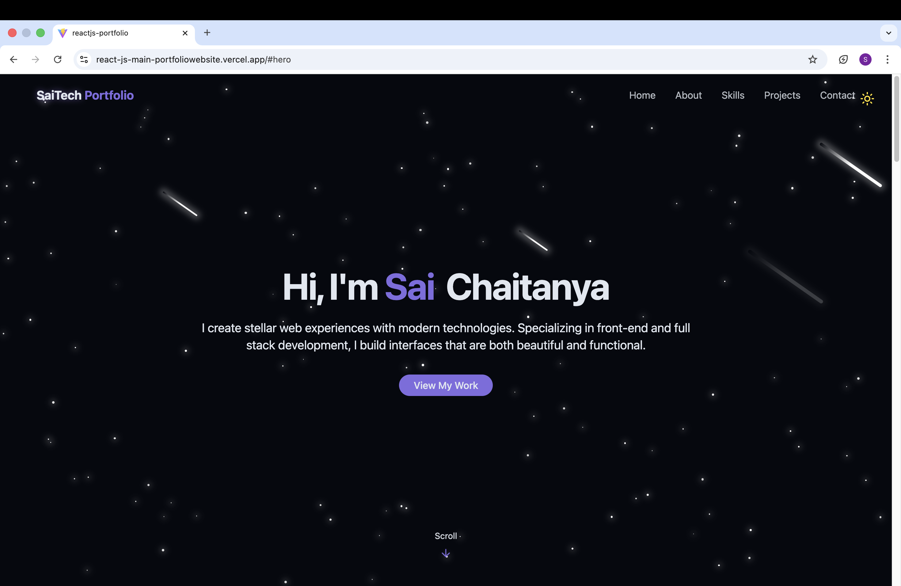
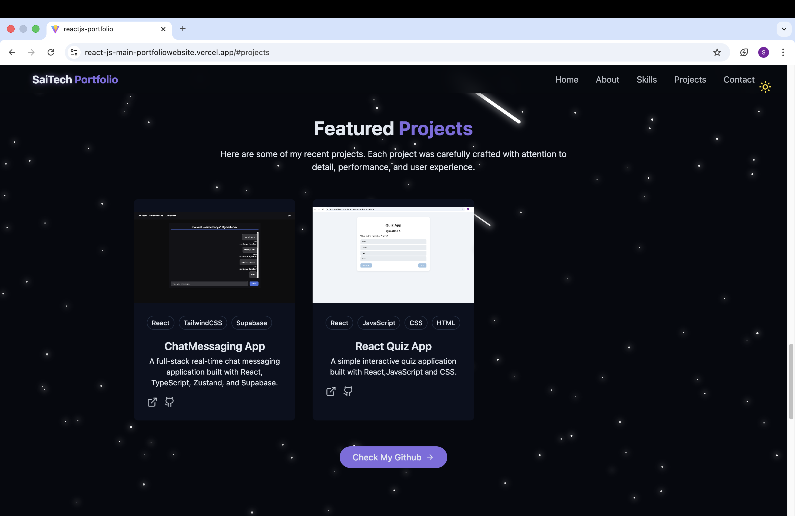
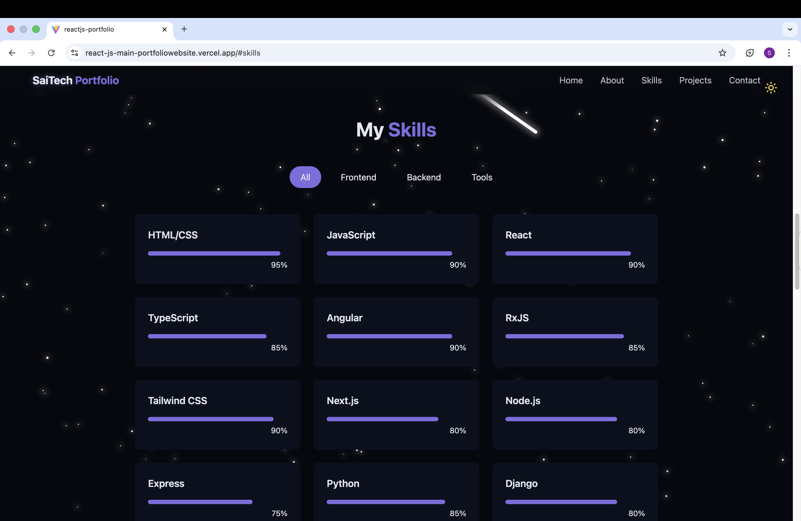
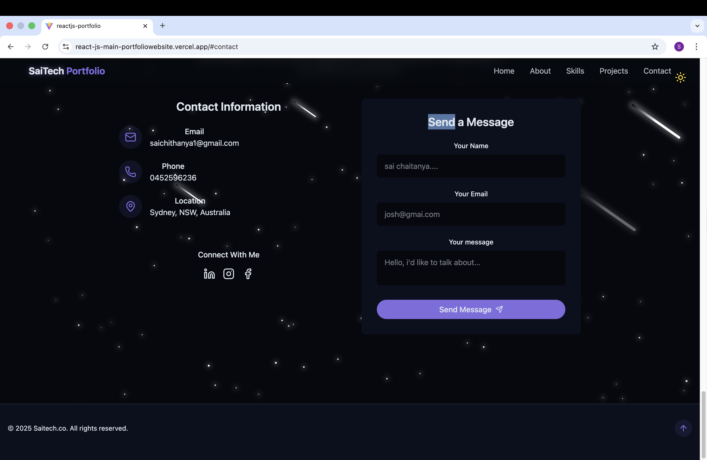

# Sai Chaitanya Gaddam – Portfolio Website

A **personal portfolio website** built with **ReactJS** and **Tailwind CSS**, showcasing my **projects**, **skills**, and allowing visitors to **contact me directly**.  

---

## 👋 About Me

Hi! I'm **Sai Chaitanya Gaddam**, a passionate **Frontend and Fullstack Developer** based in Sydney, Australia.  
I specialize in building **modern, responsive, and interactive web applications** using **ReactJS**, **Tailwind CSS**, **Node.js**, and **Django**.  

I enjoy turning ideas into functional web applications and continuously learning new technologies to improve my skills.  
This portfolio reflects my work, creativity, and technical expertise, showcasing my projects, skills, and how I approach problem-solving in web development.

---

## 🌟 Motivation

I built this portfolio to:  
- Showcase my **ReactJS projects** in a professional way.  
- Demonstrate my skills in **frontend development** and **UI/UX design**.  
- Provide a central place for potential employers and collaborators to **explore my work and contact me**.  

---

## 🌟 Features

- Fully responsive design for all devices.  
- Projects section with detailed descriptions, tech stack, and live links.  
- Skills section with animated proficiency bars.  
- Contact form with **toast notifications** for submissions.  
- Smooth scrolling and scroll-to-top button.  
- Modern UI with hover effects and section animations.  
- Clean and minimal design for readability and usability.  

---

## 🛠️ Technologies Used

- **Frontend:** ReactJS, Vite  
- **Styling:** Tailwind CSS  
- **Icons:** Lucide React  
- **Notifications:** Radix UI Toast + Custom Hook  
- **Routing:** React Router DOM  
- **State Management:** React Hooks  
- **Deployment:** Vercel  

---
## 🖼️ Screenshots (Static Images)

### Home

### Projects

### Skills

### Contact

### Footer / Scroll-to-Top

---
## 🚀 Live Demo

